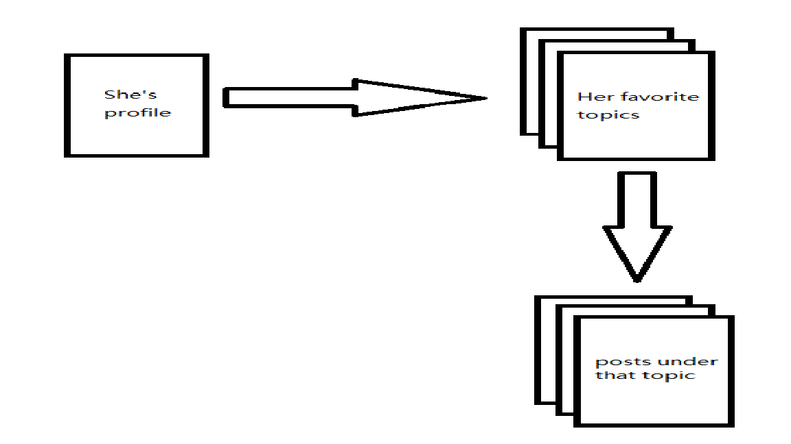

# AmazonCrawler

## Project Overview
### Reason for Starting this Project
>The reason I started this project is kind of stange: my laptop broke down! This reason seems have nothing to do with a web crawler. Please let me explain. 

>There is a serious problem with the screen of my laptop: whole screen is amost in red color and I can't see anything unless I use an external display. When I bought my laptop, I didn't pay too much attention to those comments on Internet about that model. I just didn't realize those information is very useful at that time. Now, my laptop broke down and I search that problem on Internet,  I frustratedly find that such problem is a common and unsolvable problem of that model. I am so regretted about I didn't check the comments on Internet when I decided to buy that model. 

>So, I think, if I gather the information of all the laptop models and their comments. Then, I can do something kinds of nature language processing on the comments(Honestly, I am totally not an expert of NLP. So, I am not sure which kind of technique should be used here. I am still working on that. Actually, the NLP part is beyond the scope of this project.). At least, I can extract some key words associated with positive/negative adjectives(In my case, that will be something like "screen"<-->"horrible".). This application may need significent mount of work at back end and front end to make it like a workable solution. Besides of that, the most important work is gathering the data. That's why I need to build a web crawler.  

### Original and Further Thoughts 
>The original object of this project is building a Python asynchronous web crawler with fixed parsing rules. At First, this crawler is built for crawling laptop informations on Amazon. Hence, the parsing rules for each page are designed only for certain kinds of pages and hard written as the member methods of crawler class with name parse_pagetype. This means that the code of this project can hardly be reused unless I am willing to refactor it.

>In the processing of development, I realized that the parsing rules could be seperated out, and common part of asynchronous I/O, such as network I/O, disk I/O and etc, could be packed up and refactor as a frame work. There are surely some excellent scrawler frame works, like Scapy. But, I don't think all the affort I have spend on this project is meaningless.

## The Work Flow of AmazonCrawler
>In order to understand the work flow of this crawler, we must first under stand the data model.

>Generally, we can view the crawler as factory: In this factory, there is one pipline, products will be put into the pipline by a certain kind of worker, generator, that only GENERATE partially finished products. There is another kind of worker, appender, work on this pipline. They will take a partailly finished product and APPEND something to that product. After they finish their work, they will either put the product back to the pipline if that product still needs some work to be done or finished that product and put that product into back store.

>This is the general idea of this crawler framework(2016/5/22, at this point, I've only finshed the very basic structure of the framework.), Here comes the question: how user use this frame work? Lets first use a general example to illustrate the usage, then we will fully analyze the exmple of crawling all the information of Laptops on Amazon.

>Before building a crawler by this framework, user must has their data model and how the data can be obtained in their mind. If all the needed pages form a tree structure and require certain traversal strategies, this framework will be a quite suitable solution. 

>Let imagine such a situation: I like a girl and I've added her as my friend on a forum. So, I can access her profile page. On her profile page I can find her favorite topics. By those topic links, I can access the main pages of those topics. Here is the problem: I want to receive push notifications of the 10th newest posts under my girl's favorite topics every day(If I read those post, I will have a lot stuff to talk with her), but the forum doesn't provide such a highly customized service. So, I have to build one on my own and the first thing to do is to build a crawler which can get me those posts, and then I can easily build a tiny Web service to send those posts either to my mailbox or to my cell-phone.

>Suppose the data item for each post is like this: 
>```python
class PostItem(object):
    def __init__(self, last_viewed_time, post_time, topic, pos, title, body):
        self.last_viewed_time = last_viewed_time
        self.post_time = post_time
        self.topic = topic
        self.pos = pos
        self.title = title
        self.body = body
```
>Most of the fields in this item are quite easy to understand: `post_time` is the time that this post was posted. `topic` is the topic this post belongs to. `pos` is the position of this post(from 1 to 10). `title` and `body` are the title and text body of that post. The only thing which is hard to understand is the field `last_viewed_time`. This field indicates the latest time that my girl browses a topic. Why this field is important? Because combining with the `post_time`, I can figure out whether my girl has watched a certain post. This is important, right? Because I don't want to always talk about stuffs she already knows. 

>Okay, the structure of this data item may be easy to come up with, but how to populate those fields while traversing? That's kind of tricky. Suppose the site map of that forum is like following:

>

>As we can see in above figure, those pages we will traverse to retrieve the needed information forms a perfect tree structure. Let's assume `last_viewed_time` can only be read at her profile page, `pos` can only be read at topic's main page. The rest of the fields can be found either at topic's main page and post's page. Those scattered field brings some sort difficulties. Let's first examine some posible strategies: 

>>(1) Download those pages as HTML files, and retrieve information from local saved html files.
>>>if we use this strategy, the crawler will be pretty simple, we just have to take care of extracting links from pages and that's it. But when we retrieving data from local html files, we first have to figure out the category of the current page I am working with. It's quite reasonable: different fields come from different page categories. So, for different page category we need different parse algorithm. That is to say, we need to write extra program to recognize page category, either based on rules or some machine learning algorithms. 

>>(2) Retrieve data when traversing, and store the data as Json object on disk.
>>>if we use this strategy, the problem in (1) can be solved in some extent, since the page category is easy to get in traversing. For example, when I go to a main page of topic from a link on her profile page, I am 100% sure the page I am going to is a main page of a topic. So, with the page category infomation, I can figure out which parsing algorithm to use for a certain page. But, another problem raises, the information scatters around: when I reach her profile page, I get `[last_viewed_time]`. Then I go to a main page of a certain topic, I can get `[post_time, topic, pos]`. Then I go to a post page, I can extract `[title, body]`. So, there will be three seperated Json files, but all corresponding to a single data item. This requires a method to assigned a unique id to the each pieces which enanble us to resemble them. This also introduces extrac work(maybe use a database can easily solve this). 

>This framework is a modification of (2). In this framework, I designed a elegent user interface to let user to associate certain page parsing method with a page type(a string identifier). Let's see how to use this framework to build this crawler: If you remeber I described my framework as a factory with a single pipline and two kinds of workers work on this pipline: generator and appender. So, In this case, the method which parses my girl's profile page is a generator which create a new data item and append some information to itm then put it back to pipline. Let's see how to make a method as a generator in this framework.

>My framework provides a decorator utilities to wrap a method and make it a generator/appender. First, you have to:
>```python
from AsyncCrawlerUtils import parsermethod, ParserType, QueuingTask
```
>parsermethod is a decorator which takes two arguments: the first argument is the parser type which is spefied by using enum type `ParserType`. QueuingTask is the abstraction of a 'product' on pipline. In this case, to define a generator method to parse my girl's profile page, I have to:
```python
@parsermethod(ParserType.GENERATOR, 'profile')
def parse_profile_page(self, text):
    todo, done = [], []
    '''
    create a new item
    '''
    data_item = PostItem()
    '''
    populate field(s)
    '''
    data_item.last_viewed_time = extract_last_viewed_time()
    '''
    extract links to topic page
    '''
    topic_links = extract_topic_links(text)
    '''
    create 'products' which has to be 
    finished by another workers
    '''
    for link in topic_links:
        todo.append(QueuingTask(
            link,
            'profile',
            data_item
        ))
    return todo, done
```

### TO BE CONTINUED


